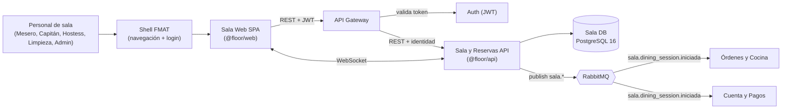
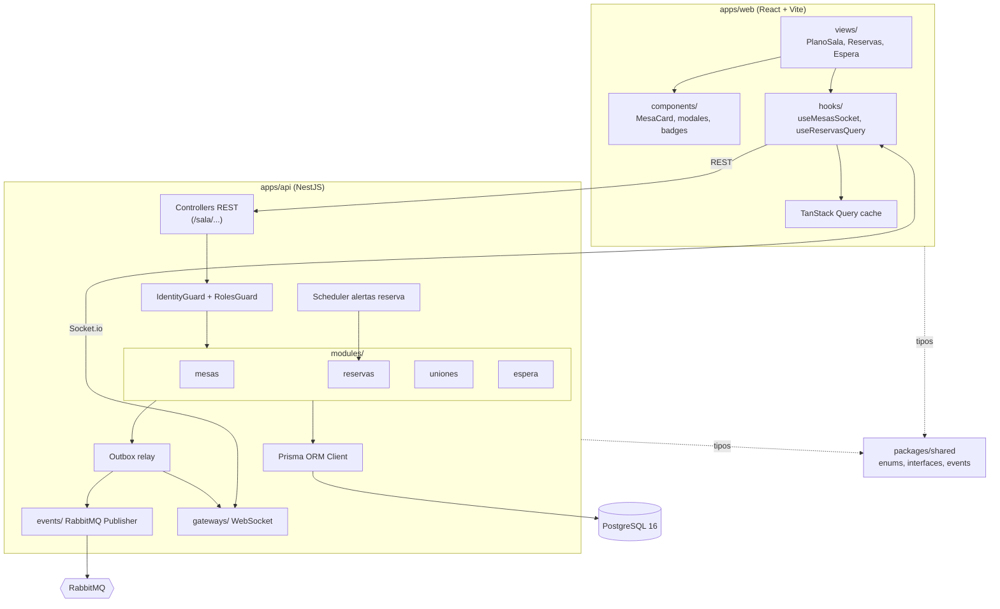

# ARCHITECTURE — Microservicio Sala y Reservas (Floor-Module)

> **Cómo está construido el sistema.** Requisitos en [REQUIREMENTS.md](./REQUIREMENTS.md); comportamiento en [SPEC.md](./SPEC.md).
> Decisión base formal: [`docs/adr/ADR-001-stack-y-monorepo.md`](../docs/adr/ADR-001-stack-y-monorepo.md).
>
> Leyenda de estado: **Implementado** (existe en el repo), **Planificado** (diseño aprobado, listo para implementar), **(Pendiente con Auth)** (definición contractual con equipo externo).

---

## 1. Estilo arquitectónico

**Microservicio de dominio con integración orientada a eventos, organizado internamente como monolito modular NestJS y alojado en un monorepo a nivel de servicio.**

| Elemento | Justificación | RNF |
|---|---|---|
| Microservicio autónomo (dueño de `Sala DB`) | Límite de dominio claro (salón físico) y despliegue independiente de Cocina/Pagos. | RNF-014 |
| Integración saliente por eventos (RabbitMQ) | Desacopla a Sala de los consumidores; Sala no consume eventos externos. | RNF-005, RNF-006 |
| Tiempo real por WebSocket | Plano de sala reactivo sin polling. | RNF-002 |
| Módulos NestJS por subdominio (`mesas`, `reservas`, `uniones`, `espera`) | Cohesión, inyección de dependencias y pruebas aisladas. | RNF-013 |
| Monorepo pnpm + Turborepo con `@floor/shared` | Contratos únicos front/back/eventos. | RNF-009 |

## 2. Vista de contexto



## 3. Vista de componentes



## 4. Stack con versiones

Versiones resueltas en `pnpm-lock.yaml` (rango declarado entre paréntesis).

| Capa | Tecnología | Versión | Estado |
|---|---|---|---|
| Runtime | Node.js | 20 en CI (README: ≥ 20) | Implementado |
| Gestor de paquetes | pnpm | 9.15.0 (`packageManager`) | Implementado |
| Orquestador monorepo | Turborepo | 2.11.4 (^2.3.3) | Implementado |
| Lenguaje | TypeScript | 5.9.3 (^5.7.2) | Implementado |
| Backend | NestJS (`common`, `core`, `platform-express`, `websockets`, `microservices`) | 10.4.22 (^10.4.15) | Implementado (vacío) |
| Validación backend | class-validator / class-transformer | 0.14.4 / 0.5.1 | Instalado, sin uso |
| Tiempo real | socket.io / socket.io-client | 4.8.x (^4.8.1) | Instalado, sin uso |
| AMQP | amqplib | 0.10.9 (^0.10.5) | Instalado, sin uso |
| Frontend | React / React DOM | 18.3.1 | Implementado |
| Bundler | Vite / @vitejs/plugin-react | 6.4.3 / 4.7.0 | Implementado |
| Estilos | Tailwind CSS / PostCSS / Autoprefixer | 3.4.19 / ^8.4 / ^10.4 | Implementado |
| Estado remoto | @tanstack/react-query | 5.104.0 | Instalado, sin uso |
| Iconos / utilidades | lucide-react, clsx, tailwind-merge | ^0.469 / ^2.1 / ^2.5 | Instalado |
| Base de datos | PostgreSQL | 16 (`postgres:16-alpine`) | docker-compose |
| Broker oficial | **RabbitMQ** | 3.x (`rabbitmq:3-management-alpine`) | docker-compose (Redis Streams descartado) |
| ORM oficial | **Prisma** | Por instalar (Prisma 5.x / 6.x) | Aprobado (Drizzle descartado) |
| UI Kit / Diseño | Guía Visual de Componentes v2.0 (`docs/guia-visual-componentes.md`) | v2.0 | Implementado como referencia |
| Tests | @nestjs/testing (instalado); runner no configurado | 10.4.22 | Deuda técnica |
| CI | GitHub Actions (`actions/checkout@v4`, `pnpm/action-setup@v4`, `actions/setup-node@v4`) | — | Implementado |

## 5. Estructura de directorios

```text
salaModule/
├── .github/workflows/ci.yml   # CI: install --frozen-lockfile → lint → build → test (Node 20)
├── agents/                    # Documentación operativa para agentes de IA (este archivo y hermanos)
├── apps/
│   ├── api/                   # @floor/api — NestJS (CommonJS), puerto 3001
│   │   ├── prisma/            # Planificado: schema.prisma y migraciones SQL
│   │   └── src/
│   │       ├── main.ts        # Bootstrap, CORS, puerto
│   │       ├── app.module.ts  # Módulo raíz
│   │       ├── modules/{mesas,reservas,uniones,espera}/  # Subdominios (controller, service, dto)
│   │       ├── events/        # Publishers RabbitMQ + Outbox Relay
│   │       ├── gateways/      # WebSocket Gateway (Socket.io)
│   │       └── common/        # Guards, filtros de error de Prisma y correlation interceptors
│   └── web/                   # @floor/web — React + Vite (ESM), puerto 3000
│       └── src/
│           ├── App.tsx, main.tsx, index.css
│           ├── views/         # PlanoSala, Reservas, Espera
│           ├── components/    # MesaCard, modales, badges
│           └── hooks/         # useMesasSocket, useReservasQuery
├── packages/
│   └── shared/                # @floor/shared — contratos (ESM, compila a dist/)
│       └── src/
│           ├── enums/         # EstadoMesa, EstadoReserva (con No-show), EstadoEspera, EstadoUnion
│           ├── interfaces/    # Mesa, Reserva (con cantidad_personas), AsignacionMesero, ListaEspera, UnionMesa
│           ├── events/        # EVENT_TOPICS + payloads de eventos
│           └── schemas/       # DTOs y schemas de validación compartidos
├── docs/                      # Fuente de dominio, guía visual y ADR formal
├── docker-compose.yml         # PostgreSQL 16 + RabbitMQ (management) locales
├── turbo.json                 # Tareas build/lint/dev/test/clean
├── pnpm-workspace.yaml        # Workspaces apps/* y packages/*
└── package.json               # Scripts raíz (delegan en turbo)
```

## 6. Flujo de datos

1. **Comando:** SPA → (JWT) → API Gateway → `@floor/api` controller.
2. **Autorización:** guard lee identidad/rol propagados por el Gateway.
3. **Dominio:** el servicio del módulo ejecuta reglas de negocio (SPEC §3) dentro de una transacción `prisma.$transaction`.
4. **Persistencia + outbox:** en la misma transacción se escriben los cambios de entidad y el registro en la tabla `outbox_evento`.
5. **Respuesta:** HTTP 200/201 al cliente tras el commit.
6. **Difusión asíncrona:** el relay del outbox publica en RabbitMQ (`sala.*`) y emite por Socket.io a los frontends suscritos.
7. **Consumo:** Cocina y Pagos consumen `sala.dining_session.iniciada`; la SPA invalida su caché de TanStack Query.
8. **Lecturas:** consultas REST directas (`estado-en-vivo`) son la fuente de verdad tras reconexión.

## 7. Persistencia

- **Motor:** PostgreSQL 16, base `floor_module_db` (local vía docker-compose). Sala es el único dueño.
- **ORM:** **Prisma Client** con migraciones (`prisma migrate`).
- **Integridad en motor:**
  - Extensión `btree_gist` habilitada.
  - Restricción `EXCLUDE USING gist (id_mesa WITH =, rango WITH &&) WHERE (estado = 'Confirmada')` para bloquear matemáticamente el doble agendamiento.
  - Índice único parcial en `Mesa(numero_mesa) WHERE activo = true`.
  - Índice único parcial en `AsignacionMesero(id_mesa) WHERE activo = true`.
- **Outbox:** tabla `outbox_evento(id uuid, routing_key text, payload jsonb, correlation_id text, creado_en timestamptz, publicado_en timestamptz null, intentos int)`.
- **Configuración:** variables de entorno (`DATABASE_URL`, `RABBITMQ_URL`, `PORT`, `RESERVA_PROXIMA_VENTANA_MINUTOS`, `CORS_ORIGIN`).

## 8. Autenticación y autorización

- **Autenticación:** delegada al API Gateway / Auth. Sala no almacena contraseñas ni valida JWT directamente.
- **Identidad en Sala:** Gateway inyecta identidad del usuario y roles. Contrato de cabeceras pendiente de confirmación formal con el equipo de Auth (Q4).
- **Autorización:** `RolesGuard` aplica la matriz de permisos de SPEC §1.1.
- **WebSocket:** handshake con identidad inyectada; clientes se unen a salas (`plano`, `recepcion`) según sus permisos.

## 9. Observabilidad

| Señal | Estado | Objetivo | RNF |
|---|---|---|---|
| Logs | Nest Logger por defecto | Logs JSON estructurados con `correlationId`, `userId`, `route`, `durationMs`; números de teléfono enmascarados. | RNF-011 |
| Métricas | Planificado | Métricas Prometheus: latencia p95 HTTP, eventos outbox pendientes, conexiones WS, conteo de 409 por código. | RNF-001, RNF-002, RNF-005 |
| Trazas | Planificado | OpenTelemetry HTTP → DB → AMQP; `correlationId` propagado en cabeceras de mensaje RabbitMQ. | RNF-011 |
| Salud | Planificado | `GET /health` reportando conectividad con PostgreSQL y RabbitMQ. | RNF-006 |

## 10. Despliegue y entornos

| Entorno | Descripción | Estado |
|---|---|---|
| Local | `docker compose up -d` (Postgres + RabbitMQ) + `pnpm dev` (web :3000, api :3001). | Implementado |
| CI | GitHub Actions en push/PR a `main` y `develop`, `workflow_dispatch` y cron semanal. | Implementado |
| Staging / Producción | Imagen Docker por app (`apps/api/Dockerfile`, `apps/web/Dockerfile`) con builds cacheados por Turborepo. | Planificado |

## 11. Estrategia de pruebas

| Nivel | Alcance | Herramienta | Ubicación |
|---|---|---|---|
| Unitarias | Reglas de negocio de servicios (SPEC §3), mapeos DTO. | Jest + `@nestjs/testing` | `apps/api/src/**/*.spec.ts` |
| Integración | Prisma, restricciones `EXCLUDE`, transacciones, outbox con PostgreSQL real. | Jest + Postgres | `apps/api/test/integration` |
| API / E2E backend | Contratos REST y códigos de error (409 normalizado) de SPEC §5. | supertest | `apps/api/test/e2e` |
| Contrato de eventos | Payloads publicados cumplen tipos de `@floor/shared`. | Jest + contratos shared | `apps/api/test/contract` |
| Frontend | Componentes de sala, estados loading/empty/error de guía visual. | Vitest + Testing Library | `apps/web/src/**/*.test.tsx` |
| Concurrencia | Concurrencia de reservas y ocupación simultánea (T1.3, T2.3 de SPEC). | Jest de integración | `apps/api/test/integration` |

## 12. Decisiones de diseño (ADR)

**ADR-001 — Monorepo por módulo, stack full TypeScript y Prisma ORM** · Aceptado · Motivado por RNF-009, RNF-014
- *Contexto:* contratos compartidos front/back/eventos que cambian a la par; necesidad de modelado relacional ACID.
- *Decisión:* monorepo pnpm + Turborepo con `@floor/shared`; NestJS + React; **Prisma** como ORM oficial.
- *Descartadas:* polyrepo (duplicación de tipos/versionado de paquete); Drizzle ORM (descartado por decisión del equipo).
- *Consecuencias:* PRs atómicos y tipeo de base de datos generado automáticamente.

**ADR-002 — No solapamiento de reservas en motor (`tstzrange` + `EXCLUDE`)** · Aceptado · Motivado por RNF-003
- *Contexto:* reservas concurrentes sobre la misma mesa.
- *Decisión:* columna `rango tstzrange` y restricción `EXCLUDE USING gist` filtrada por `estado = 'Confirmada'`.
- *Descartadas:* validación sólo en código de aplicación (vulnerable a race conditions).
- *Consecuencias:* requiere `btree_gist` y traducción limpia de violación a 409 `RESERVA_SOLAPADA`.

**ADR-003 — Integración saliente por RabbitMQ con routing keys `sala.*`** · Aceptado · Motivado por RNF-005, RNF-006, RNF-014
- *Contexto:* Cocina y Pagos deben reaccionar al inicio del servicio sin acoplamiento temporal ni dependencias circulares.
- *Decisión:* publicar eventos en topics RabbitMQ (AMQP). Sala no consume eventos externos.
- *Descartadas:* llamadas HTTP síncronas; Redis Streams (descartado a favor de RabbitMQ ya presente en infraestructura).
- *Consecuencias:* consistencia eventual garantizada mediante outbox transaccional.

**ADR-004 — Tiempo real con Socket.io + invalidación TanStack Query** · Aceptado · Motivado por RNF-002, RNF-012
- *Contexto:* terminales de meseros y hostess requieren actualización inmediata del salón.
- *Decisión:* WebSocket Gateway de NestJS emite transiciones; el cliente invalida queries sin reemplazar REST como fuente de verdad.
- *Descartadas:* polling periódico (sobrecarga de red y latencia).
- *Consecuencias:* experiencia reactiva con fallback REST en reconexión.

**ADR-005 — Sala genera `sessionId` (UUID v4) y no persiste DiningSession** · Aceptado · Motivado por RNF-014
- *Contexto:* el ciclo de comanda gastronómica y cobro pertenece a Cocina y Pagos.
- *Decisión:* Sala no persiste la sesión, pero genera un identificador correlativo `sessionId` (UUID v4) en el evento `sala.dining_session.iniciada`.
- *Descartadas:* persistir la sesión en Sala (rompe fronteras); dejar que cada servicio genere su propio ID sin correlación.
- *Consecuencias:* trazabilidad única en todo el ecosistema desde el momento de sentar a los comensales.

**ADR-006 — Outbox transaccional para eventos** · Aceptado · Motivado por RNF-005, RNF-004
- *Contexto:* publicar eventos directamente tras commit puede perder mensajes si el proceso o RabbitMQ fallan.
- *Decisión:* escribir en `outbox_evento` en la misma transacción SQL y procesar con relay asíncrono con reintentos y `x-event-id`.
- *Descartadas:* publicación síncrona sin persistencia intermedia.
- *Consecuencias:* garantía de entrega at-least-once.

**ADR-007 — Autenticación delegada al API Gateway** · Aceptado · Motivado por RNF-007
- *Contexto:* Auth y Gateway gestionan firmas JWT y tokens de acceso centralizados.
- *Decisión:* Sala confía en la identidad propagada por el Gateway y valida roles internamente.
- *Consecuencias:* requiere mantener contrato claro de cabeceras de autorización.

**ADR-008 — Liberación de mesas sólo por confirmación operativa** · Aceptado · Motivado por RNF-014
- *Contexto:* el cobro de la cuenta no significa que los comensales hayan abandonado físicamente la mesa.
- *Decisión:* la transición `Ocupada → Limpieza pendiente → Libre` se realiza exclusivamente por confirmación del personal.
- *Descartadas:* liberación automática al recibir `PagoCompletado`.
- *Consecuencias:* fidelidad con la operativa real del restaurante.

**ADR-009 — Restricción de uniones por zona física y código 409 normalizado** · Aceptado · Motivado por RNF-004
- *Contexto:* unir mesas distantes genera desorden operativo; además, existía inconsistencia de códigos de error (400 vs 409).
- *Decisión:* se valida que todas las mesas a unir pertenezcan a la **misma zona**. Todo conflicto de ocupación, unión o reserva responde uniformemente con **409 Conflict**.
- *Descartadas:* permitir unir mesas de cualquier zona sin control de área; devolver 400 Bad Request ante conflictos de estado.
- *Consecuencias:* coherencia en el manejo de errores de frontends y respeto a la distribución física del salón.

**ADR-010 — Advertencias operativas en ocupación (reserva próxima y sobrecupo)** · Aceptado · Motivado por RNF-001, RNF-010
- *Contexto:* evitar sentar comensales en mesas con reservas agendadas en los próximos 30 minutos por descuido, y permitir sobrecupo voluntario.
- *Decisión:* la API responde 409 (`RESERVA_PROXIMA_PRESENTE` / `SOBRECUPO_DETECTADO`) a menos que la petición incluya las banderas de confirmación `forzarOcupacion: true` o `forzarSobrecupo: true`.
- *Descartadas:* bloqueo rígido que impida al restaurante acomodar comensales ante imprevistos; permitir sobrecupo sin registrar confirmación.
- *Consecuencias:* balance óptimo entre control preventivo y flexibilidad operativa.

## 13. Deuda técnica conocida

| ID | Deuda | Impacto |
|---|---|---|
| DT-01 | Scripts `lint` y `test` son `echo` (CI pasa vacío). Faltan ESLint, Prettier y runner de Jest/Vitest. | Sin validación automatizada de código en CI (RNF-013). |
| DT-02 | Prisma ORM aprobado pero aún no instalado en `apps/api/package.json`. | Pendiente agregar dependencia y crear `schema.prisma`. |
| DT-03 | `apps/api/tsconfig.json` con `strictNullChecks: false` y `noImplicitAny: false`. | Posibles errores de nulabilidad en backend no advertidos por el compilador. |
| DT-04 | `@floor/shared` es ESM (`"type": "module"`) y la API compila a CommonJS. | Verificar compatibilidad de imports al conectar módulos de runtime. |
| DT-05 | CORS `origin: '*'` con `credentials: true` en `apps/api/src/main.ts`. | Inseguro para producción e inválido en navegadores cuando hay credenciales. |
| DT-06 | `apps/web/tailwind.config.js` y `App.tsx` no tienen los tokens oficiales de la guía visual (usan colores temporales como `indigo`). | Incumple guía visual v2.0 (RNF-010). |
| DT-07 | Interfaces históricas de shared usan `snake_case` y la API está definida en `camelCase`. | Mapear o migrar interfaces hacia convención unificada. |
| DT-08 | Payloads de eventos sin campos explícitos de correlación/evento en AMQP. | Incorporar `x-event-id` y `x-correlation-id` en cabeceras de RabbitMQ. |
| DT-09 | Faltan Dockerfiles para producción y plantilla `.env.example`. | Despliegue de contenedores incompleto. |
| DT-10 | `docker-compose.yml` usa credenciales por defecto en texto plano. | Configuración de secretos local no aislada. |
| DT-11 | *(Resuelta / Descartada)* Referencia a `mockups_sala.html` eliminada; la única fuente de diseño es `guia-visual-componentes.md`. | — |
| DT-12 | `turbo.json` incluye `.next/**` no utilizado. | Tarea de limpieza menor en caché de Turborepo. |
