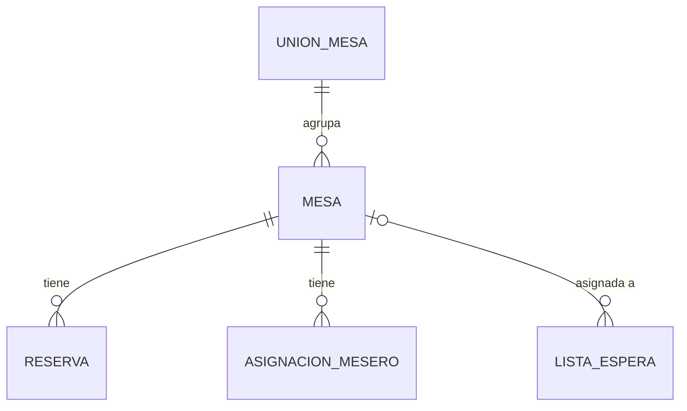
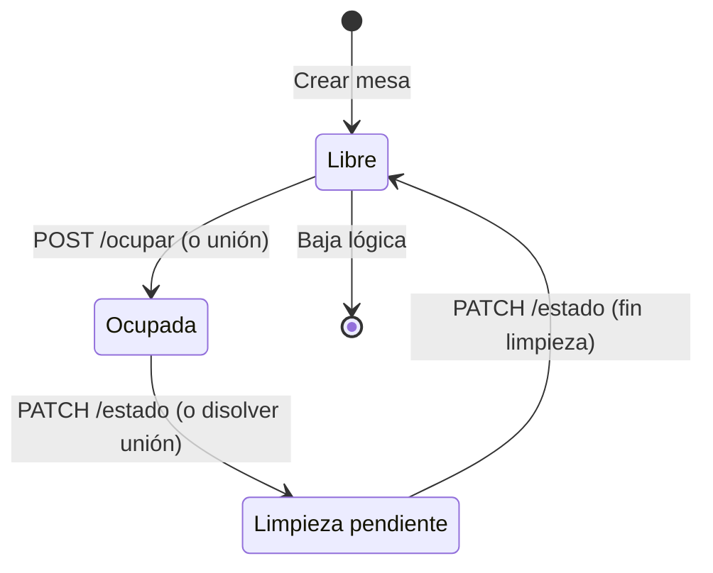
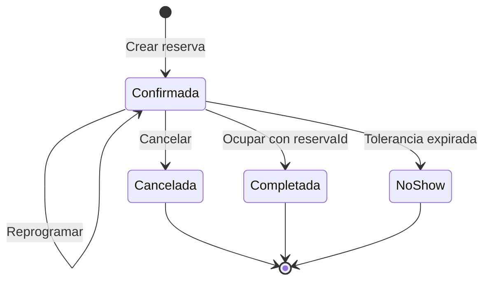
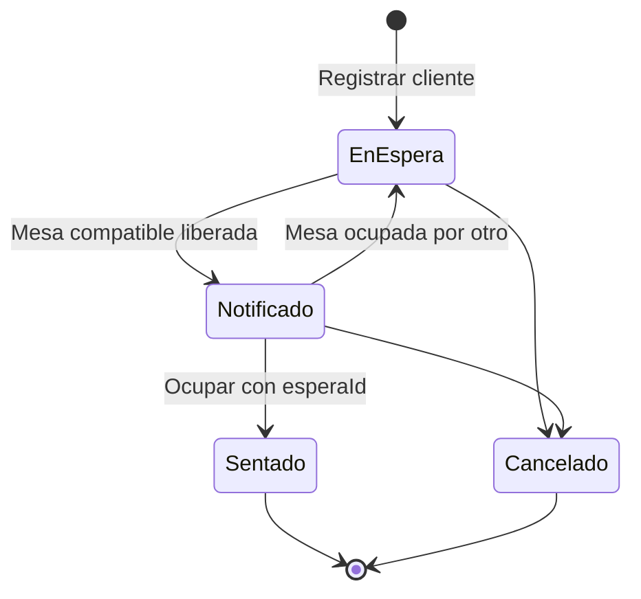
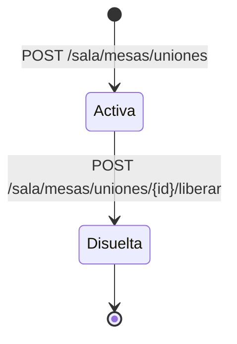

# SPEC — Microservicio Sala y Reservas (Floor-Module)

> **Cómo se comporta el sistema para cumplir los requisitos** de [REQUIREMENTS.md](./REQUIREMENTS.md).
> Construcción y decisiones técnicas en [ARCHITECTURE.md](./ARCHITECTURE.md).
> Fuente de dominio: [`docs/Microservicio_Sala_Reservas.md`](../docs/Microservicio_Sala_Reservas.md). Contratos TypeScript vigentes: [`packages/shared/src`](../packages/shared/src/index.ts).
>
> **Decisiones confirmadas por el equipo:** Normalización de errores de ocupación/unión a 409, `cantidad_personas` en reservas, estado `No-show`, unión restringida a misma zona, advertencias en ocupación con sobrecupo y reserva próxima (30 min base configurable), Prisma + RabbitMQ.

---

## 1. Convenciones generales

Satisface: RNF-007, RNF-008, RNF-009, RNF-011

- **Base path:** `/sala` (enrutado por el API Gateway). Puerto local de la API: `3001`.
- **Formato:** JSON UTF-8. Campos en la API y eventos en `camelCase`; columnas de BD en `snake_case`.
- **Fechas:** ISO-8601. Instantes en UTC con offset (`2026-10-07T20:30:00Z`); `fecha` como `YYYY-MM-DD`, `hora` como `HH:mm` en la zona horaria del restaurante.
- **Identidad:** el Gateway valida el JWT y propaga la identidad y roles en cabeceras HTTP (formato pendiente con Auth: Q4). Sala responde 401 si faltan credenciales o identidad válida.
- **Correlación:** cabecera `x-correlation-id` (se genera si no viene); se propaga en logs, respuestas y en los metadatos de eventos AMQP.
- **Tamaño máximo de request:** 64 KB → 413.
- **Formato de error estándar:**

```json
{
  "statusCode": 409,
  "code": "MESA_NO_DISPONIBLE",
  "message": "La mesa se encuentra ocupada o en limpieza",
  "details": {}
}
```

| HTTP | Uso |
|---|---|
| 400 | Validación de esquema, tipos o payload inválido (`VALIDACION`, `UNION_INVALIDA`). |
| 401 | Falta identidad propagada por el Gateway (`NO_AUTENTICADO`). |
| 403 | Rol sin permiso para la acción (`NO_AUTORIZADO`). |
| 404 | Recurso inexistente o inactivo (`MESA_NO_ENCONTRADA`, `RESERVA_NO_ENCONTRADA`, `UNION_NO_ENCONTRADA`, `ESPERA_NO_ENCONTRADA`). |
| 409 | Conflicto de estado, disponibilidad o concurrencia (`MESA_NO_DISPONIBLE`, `RESERVA_SOLAPADA`, `TRANSICION_INVALIDA`, `MESA_EN_UNION`, `NUMERO_MESA_DUPLICADO`, `ZONA_INCOMPATIBLE`, `RESERVA_PROXIMA_PRESENTE`, `SOBRECUPO_DETECTADO`). |
| 413 | Payload excede 64 KB. |
| 500 | Error no controlado (`ERROR_INTERNO`), sin filtrar detalles internos de persistencia. |

### 1.1 Matriz de autorización (Base para integración con Auth)

| Acción | Admin | Capitán | Mesero | Hostess | Limpieza |
|---|:-:|:-:|:-:|:-:|:-:|
| CRUD mesas | ✔ | | | | |
| Consultar plano / reservas / espera | ✔ | ✔ | ✔ | ✔ | ✔ |
| Ocupar mesa (normal o forzada) | ✔ | ✔ | ✔ | ✔ | |
| Cambiar estado físico | ✔ | ✔ | ✔ | | ✔ |
| Asignar / reasignar mesero | ✔ | ✔ | | | |
| Reservas (crear/reprogramar/cancelar/no-show)| ✔ | ✔ | | ✔ | |
| Uniones (crear y liberar) | ✔ | ✔ | | ✔ | |
| Lista de espera | ✔ | ✔ | | ✔ | |

---

## 2. Modelo de datos

Satisface: RF-001–RF-022, RNF-003, RNF-004



### 2.1 `Mesa`

| Campo | Tipo | Restricciones |
|---|---|---|
| `id_mesa` | UUID | PK. |
| `numero_mesa` | integer | `> 0`; único entre mesas con `activo = true`. |
| `capacidad` | integer | `≥ 1`. |
| `zona` | varchar(50) | No vacío (define agrupación física en salón). |
| `estado_fisico` | enum `EstadoMesa` | `Libre` \| `Ocupada` \| `Limpieza pendiente`; default `Libre`. |
| `id_union_mesa` | UUID null | FK → `UnionMesa.id_union`. No nulo sólo si la unión está `Activa`. |
| `activo` | boolean | Default `true`. Baja lógica. |
| `creado_en`, `actualizado_en` | timestamptz | Auditoría automática. |
| `ocupada_desde` | timestamptz null | Para calcular tiempo transcurrido en la card de sala. |

> `tieneReservaProxima` es un atributo **calculado en tiempo de consulta** (ver RN-08), no persistido.

### 2.2 `Reserva`

| Campo | Tipo | Restricciones |
|---|---|---|
| `id_reserva` | UUID | PK. |
| `id_mesa` | UUID | FK → `Mesa`. |
| `nombre_contacto` | varchar(120) | No vacío. |
| `telefono_contacto` | varchar(20) | 7–20 caracteres `[0-9 +()-]`. |
| `cantidad_personas` | integer | Obligatorio, `≥ 1`, `≤ Mesa.capacidad`. |
| `fecha_reserva` | date | Fecha (día de servicio). |
| `hora_inicio`, `hora_fin` | time | `hora_fin > hora_inicio`; `hora_fin = hora_inicio + duracion`. |
| `rango` | tstzrange | Rango temporal semiabierto generado `[inicio, fin)`. |
| `estado` | enum `EstadoReserva` | `Confirmada` \| `Cancelada` \| `Completada` \| `No-show`. |
| `alerta_emitida` | boolean | Default `false` (garantiza idempotencia en alerta próxima). |

Restricción a nivel motor de base de datos en PostgreSQL (Prisma raw migration):
```sql
ALTER TABLE "Reserva" ADD CONSTRAINT "reserva_no_solapada_excl"
EXCLUDE USING gist (id_mesa WITH =, rango WITH &&)
WHERE (estado = 'Confirmada');
```

### 2.3 `AsignacionMesero`

| Campo | Tipo | Restricciones |
|---|---|---|
| `id_asignacion` | UUID | PK. |
| `id_mesa` | UUID | FK → `Mesa`. |
| `id_mesero` | varchar(64) | Referencia externa del personal (claim `sub` de Auth). |
| `fecha_hora_inicio` | timestamptz | No nulo. |
| `fecha_hora_fin` | timestamptz null | `> fecha_hora_inicio`. |
| `activo` | boolean | Índice único parcial `(id_mesa) WHERE activo`. |

### 2.4 `ListaEspera`

| Campo | Tipo | Restricciones |
|---|---|---|
| `id_espera` | UUID | PK. |
| `nombre_cliente` | varchar(120) | No vacío. |
| `telefono_contacto` | varchar(20) | Formato telefónico válido. |
| `cantidad_personas` | integer | `≥ 1`. |
| `hora_llegada` | timestamptz | Default `now()`. |
| `estado` | enum `EstadoEspera` | `En espera` \| `Notificado` \| `Sentado` \| `Cancelado`. |
| `id_mesa_asignada` | UUID null | FK → `Mesa`; fijada al notificar o sentar. |

### 2.5 `UnionMesa`

| Campo | Tipo | Restricciones |
|---|---|---|
| `id_union` | UUID | PK. |
| `zona` | varchar(50) | Debe coincidir con la zona de todas las mesas agrupadas. |
| `fecha_creacion` | timestamptz | No nulo. |
| `fecha_disolucion` | timestamptz null | No nulo sólo si `Disuelta`. |
| `estado` | enum `EstadoUnion` | `Activa` \| `Disuelta`. |

---

## 3. Reglas de negocio

Satisface: RF-003–RF-022, RNF-003, RNF-004

- **RN-01 (Condición de ocupación):** Sólo se puede ocupar una mesa si `activo = true`, `estado_fisico = Libre` y no tiene `id_union_mesa`. De lo contrario, responde 409 `MESA_NO_DISPONIBLE` o `MESA_EN_UNION`.
- **RN-02 (Sobrecupo con advertencia):** Si `comensales > capacidad`, se permite la ocupación **únicamente si se envía `forzarSobrecupo: true`**. Si se omite, la API responde 409 `SOBRECUPO_DETECTADO` indicando la capacidad máxima y solicitando confirmación explícita del personal.
- **RN-03 (Generación de Dining Session):** Al ocupar una mesa o consolidar una unión, Sala genera un `sessionId` UUID v4 y emite el evento `sala.dining_session.iniciada` junto con `sala.mesa.estado_actualizado` tras confirmar la transacción.
- **RN-04 (Transición a Ocupada):** `Libre → Ocupada` sólo se dispara vía `POST /sala/mesas/{mesaId}/ocupar` o `POST /sala/mesas/uniones`; nunca vía `PATCH /estado`.
- **RN-05 (Advertencia por Reserva Próxima):** Si una mesa `Libre` tiene `tieneReservaProxima = true` (dentro de los 30 min configurados de la reserva), se requiere `forzarOcupacion: true` para poder ocuparla con clientes espontáneos. Si se omite, responde 409 `RESERVA_PROXIMA_PRESENTE` con los datos de la reserva para evitar sentar clientes por descuido en mesas reservadas.
- **RN-06 (Salida de comensales):** `Ocupada → Limpieza pendiente` sólo se ejecuta por confirmación manual del personal (`PATCH /estado` o disolución de unión). Sala **no** transiciona mesas por eventos externos (`PagoCompletado`, cierre de comanda).
- **RN-07 (Fin de limpieza):** `Limpieza pendiente → Libre` se realiza mediante confirmación operativa vía `PATCH /estado`. Cualquier otra transición manual responde 409 `TRANSICION_INVALIDA`.
- **RN-08 (Cálculo de Reserva Próxima):** `tieneReservaProxima = true` si existe una reserva `Confirmada` para la mesa con `hora_inicio` en el intervalo `[ahora, ahora + V]`. `V` es configurable mediante la variable de entorno `RESERVA_PROXIMA_VENTANA_MINUTOS` (por defecto 30 minutos). En la interfaz de usuario, la card se renderiza con distintivo azul ("Reservada" / "Reserva próxima"), manteniendo su estado físico como `Libre`.
- **RN-09 (No solapamiento de reservas):** Dos reservas `Confirmada` sobre la misma mesa no pueden cruzarse en horario `[inicio, fin)` (intervalos semiabiertos). Se garantiza a nivel de motor mediante restricción `EXCLUDE`. Cualquier colisión responde 409 `RESERVA_SOLAPADA`.
- **RN-10 (Límites de reserva):** La reserva debe iniciar en el futuro, con duración entre 15 y 480 minutos, y `cantidad_personas ≤ capacidad`.
- **RN-11 (Ciclo de reserva y No-show):** Una reserva `Confirmada` puede pasar a:
  - `Completada`: al sentar a los comensales indicando `reservaId`.
  - `Cancelada`: por solicitud del cliente o personal.
  - `No-show`: si transcurren más de X minutos de tolerancia (configurable, default 15 min) tras la `hora_inicio` sin que los clientes hayan sido recibidos.
- **RN-12 (Unión atómica por zona):** Una unión requiere ≥ 2 mesas activas, en estado `Libre`, sin unión previa y **pertenecientes a la misma zona** (`zona`). Si alguna mesa no cumple, o si pertenecen a zonas distintas, la solicitud se rechaza con **409 Conflict** (`MESA_NO_DISPONIBLE` o `ZONA_INCOMPATIBLE`) sin modificar ninguna mesa.
- **RN-13 (Ocupación de unión):** Al crear la unión, todas las mesas participantes pasan a `Ocupada` asociadas al mismo `id_union_mesa` y se emite un único `sala.dining_session.iniciada` con `unionId` y `mesasIds`.
- **RN-14 (Disolución de unión):** Al liberar la unión, ésta pasa a `Disuelta`, cada mesa desvincula su `id_union_mesa` y transiciona atómicamente a `Limpieza pendiente`, publicando `sala.mesa.estado_actualizado` con `unionId: null`.
- **RN-15 (Bloqueo de mesa unida):** Una mesa vinculada a una unión activa no puede ser alterada individualmente por `PATCH /estado`, ni ocupada, ni dada de baja → 409 `MESA_EN_UNION`.
- **RN-16 (Asignación de mesero única):** Una mesa admite sólo una asignación activa a la vez. Reasignar cierra la previa (`activo=false`, `fecha_hora_fin=now()`) y crea la nueva en la misma transacción.
- **RN-17 (Notificación a Lista de Espera):** Al pasar una mesa a `Libre`, Sala busca en FIFO (`hora_llegada` ASC) un cliente en `En espera` con `cantidad_personas ≤ capacidad`. Si lo encuentra, la entrada pasa a `Notificado` y se emite alerta WebSocket a recepción. La mesa permanece `Libre`.
- **RN-18 (Baja lógica de mesa):** Una mesa sólo puede darse de baja si está `Libre`, sin unión y sin reservas `Confirmada` futuras → 409 si está activa en servicio o agenda.
- **RN-19 (Unicidad de número de mesa):** `numero_mesa` debe ser único entre mesas activas (`activo=true`) → 409 `NUMERO_MESA_DUPLICADO`.
- **RN-20 (Job de alerta de reserva próxima):** Un proceso recurrente evalúa las reservas próximas dentro de la ventana de 30 min y emite `sala.reserva.proxima_alerta` una sola vez por reserva (`alerta_emitida = true`).

---

## 4. Estados y transiciones

Satisface: RF-005–RF-008, RF-011–RF-022

### 4.1 Mesa (`estado_fisico`)



### 4.2 Reserva



### 4.3 Lista de espera



### 4.4 Unión de mesas



---

## 5. Contratos de interfaz REST

### 5.1 Mesas — Satisface: RF-001–RF-004, RF-023

| Método | Ruta | Request | Response | Errores |
|---|---|---|---|---|
| GET | `/sala/mesas` | query `zona?`, `estado?`, `incluirInactivas?=false` | 200 `MesaDto[]` | — |
| GET | `/sala/mesas/estado-en-vivo` | — | 200 `MesaEnVivoDto[]` | — |
| GET | `/sala/mesas/{mesaId}` | — | 200 `MesaDto` | 404 |
| POST | `/sala/mesas` | `{ numeroMesa: number; capacidad: number; zona: string }` | 201 `MesaDto` | 400, 409 `NUMERO_MESA_DUPLICADO` |
| PATCH | `/sala/mesas/{mesaId}` | `Partial<{ numeroMesa; capacidad; zona }>` | 200 `MesaDto` | 400, 404, 409 |
| DELETE | `/sala/mesas/{mesaId}` | — | 204 | 404, 409 `TRANSICION_INVALIDA`/`MESA_EN_UNION` |

```ts
type MesaDto = {
  mesaId: string;
  numeroMesa: number;
  capacidad: number;
  zona: string;
  estadoFisico: 'Libre' | 'Ocupada' | 'Limpieza pendiente';
  unionId: string | null;
  activo: boolean;
};

type MesaEnVivoDto = MesaDto & {
  tieneReservaProxima: boolean;
  ocupadaDesde: string | null;
  meseroId: string | null;
};
```

### 5.2 Ciclo operativo — Satisface: RF-005–RF-009, RF-017

| Método | Ruta | Request | Response | Errores |
|---|---|---|---|---|
| POST | `/sala/mesas/{mesaId}/ocupar` | `OcuparMesaRequestDto` | 200 `{ mesaId: string; estado: 'Ocupada'; sessionId: string; advertencias?: string[] }` | 400, 404, 409 `MESA_NO_DISPONIBLE`, `RESERVA_PROXIMA_PRESENTE`, `SOBRECUPO_DETECTADO`, `MESA_EN_UNION` |
| PATCH | `/sala/mesas/{mesaId}/estado` | `{ estado: 'Limpieza pendiente' \| 'Libre' }` | 200 `{ mesaId: string; estado: string }` | 400, 404, 409 `TRANSICION_INVALIDA`, `MESA_EN_UNION` |

```ts
type OcuparMesaRequestDto = {
  comensales: number;
  meseroId: string;
  reservaId?: string;
  esperaId?: string;
  forzarOcupacion?: boolean; // Permite ocupar mesa con reserva próxima dentro de ventana de 30m
  forzarSobrecupo?: boolean;  // Permite ocupar con comensales > capacidad
};
```

### 5.3 Meseros — Satisface: RF-010, RF-011

| Método | Ruta | Request | Response | Errores |
|---|---|---|---|---|
| PUT | `/sala/mesas/{mesaId}/mesero` | `{ meseroId: string }` | 200 `AsignacionDto` | 400, 404 |
| GET | `/sala/asignaciones` | query `meseroId?`, `activo?=true` | 200 `AsignacionDto[]` | — |

```ts
type AsignacionDto = {
  asignacionId: string;
  mesaId: string;
  meseroId: string;
  fechaHoraInicio: string;
  fechaHoraFin: string | null;
  activo: boolean;
};
```

### 5.4 Reservas — Satisface: RF-012–RF-017, RF-017b

| Método | Ruta | Request | Response | Errores |
|---|---|---|---|---|
| POST | `/sala/reservas` | `CrearReservaRequestDto` | 201 `{ reservaId: string; mesaId: string; estado: 'Confirmada' }` | 400, 404, 409 `RESERVA_SOLAPADA` |
| GET | `/sala/reservas` | query `fecha?`, `mesaId?`, `estado?` | 200 `ReservaDto[]` | — |
| GET | `/sala/reservas/disponibilidad` | query `fecha`, `horaInicio`, `duracion`, `personas` | 200 `MesaDto[]` | 400 |
| PATCH | `/sala/reservas/{reservaId}` | `Partial<{ mesaId; fecha; horaInicio; duracion; cantidadPersonas }>` | 200 `ReservaDto` | 400, 404, 409 `RESERVA_SOLAPADA`/`TRANSICION_INVALIDA` |
| POST | `/sala/reservas/{reservaId}/cancelar` | — | 200 `ReservaDto` | 404, 409 `TRANSICION_INVALIDA` |
| POST | `/sala/reservas/{reservaId}/no-show` | — | 200 `ReservaDto` | 404, 409 `TRANSICION_INVALIDA` |

```ts
type CrearReservaRequestDto = {
  mesaId: string;
  fecha: string;        // YYYY-MM-DD
  horaInicio: string;   // HH:mm
  duracion: number;     // Minutos (ej. 90)
  cantidadPersonas: number;
  cliente: {
    nombre: string;
    tel: string;
  };
};

type ReservaDto = {
  reservaId: string;
  mesaId: string;
  nombreContacto: string;
  telefonoContacto: string;
  cantidadPersonas: number;
  fecha: string;
  horaInicio: string;
  horaFin: string;
  estado: 'Confirmada' | 'Cancelada' | 'Completada' | 'No-show';
};
```

### 5.5 Uniones — Satisface: RF-018, RF-019

| Método | Ruta | Request | Response | Errores |
|---|---|---|---|---|
| POST | `/sala/mesas/uniones` | `CrearUnionRequestDto` | 201 `{ unionId: string; mesasIds: string[]; estado: 'Ocupada'; sessionId: string }` | 400 `UNION_INVALIDA`, 404, 409 `MESA_NO_DISPONIBLE`, `ZONA_INCOMPATIBLE`, `RESERVA_PROXIMA_PRESENTE`, `SOBRECUPO_DETECTADO` |
| POST | `/sala/mesas/uniones/{unionId}/liberar` | — | 200 `{ mesasIds: string[]; estado: 'Limpieza pendiente' }` | 404, 409 `TRANSICION_INVALIDA` |
| GET | `/sala/mesas/uniones` | query `estado?=Activa` | 200 `UnionDto[]` | — |

```ts
type CrearUnionRequestDto = {
  mesasIds: string[];
  totalPersonas: number;
  meseroId: string;
  forzarOcupacion?: boolean; // Si alguna mesa tiene reserva próxima en 30m
  forzarSobrecupo?: boolean;  // Si totalPersonas > suma capacidades
};

type UnionDto = {
  unionId: string;
  zona: string;
  mesasIds: string[];
  estado: 'Activa' | 'Disuelta';
  fechaCreacion: string;
  fechaDisolucion: string | null;
};
```

### 5.6 Lista de espera — Satisface: RF-020–RF-022

| Método | Ruta | Request | Response | Errores |
|---|---|---|---|---|
| POST | `/sala/espera` | `{ nombreCliente: string; telefonoContacto: string; cantidadPersonas: number }` | 201 `EsperaDto` | 400 |
| GET | `/sala/espera` | query `estado?` (default: activos `En espera`, `Notificado`) | 200 `EsperaDto[]` (orden `horaLlegada` ASC) | — |
| PATCH | `/sala/espera/{esperaId}/estado` | `{ estado: 'Sentado' \| 'Cancelado' \| 'En espera' }` | 200 `EsperaDto` | 404, 409 `TRANSICION_INVALIDA` |

```ts
type EsperaDto = {
  esperaId: string;
  nombreCliente: string;
  telefonoContacto: string;
  cantidadPersonas: number;
  horaLlegada: string;
  estado: 'En espera' | 'Notificado' | 'Sentado' | 'Cancelado';
  idMesaAsignada: string | null;
};
```

### 5.7 Operación — Satisface: RNF-006, RNF-011

| Método | Ruta | Response |
|---|---|---|
| GET | `/health` | 200 `{ status: 'ok', db: 'up', broker: 'up' }` / 503 si alguna dependencia crítica cae. |

---

## 6. Contratos asíncronos

Satisface: RF-005, RF-008, RF-009, RF-016, RF-020, RNF-002, RNF-005

### 6.1 Broker (RabbitMQ — contratos en `@floor/shared`)

| Routing key (`EVENT_TOPICS`) | Payload | Consumidores |
|---|---|---|
| `sala.dining_session.iniciada` | `DiningSessionIniciadaPayload` (con `sessionId` UUID v4 generado por Sala) | Órdenes y Cocina, Cuenta y Pagos |
| `sala.mesa.estado_actualizado` | `MesaEstadoActualizadoPayload` | Monitores de sala, Gateways de frontend |
| `sala.reserva.proxima_alerta` | `ReservaProximaAlertaPayload` | Estaciones de recepción y Hostess |

Cabeceras AMQP obligatorias:
- `x-event-id`: UUID v4 único (deduplicación at-least-once).
- `x-correlation-id`: ID de trazabilidad.
- `content-type`: `application/json`.
- `delivery-mode`: `2` (mensajes persistentes).

### 6.2 WebSocket (Socket.io en `/sala`)

| Evento | Payload | Destinatarios |
|---|---|---|
| `mesa.estado_actualizado` | `MesaEstadoActualizadoPayload` | Todos los clientes del plano de sala |
| `reserva.proxima_alerta` | `ReservaProximaAlertaPayload` | Recepción / Hostess |
| `espera.mesa_disponible` | `{ mesaId: string; esperaId: string; cliente: { nombre: string; cantidadPersonas: number } }` | Recepción / Hostess |

---

## 7. Flujos principales y alternos

### F1 — Ocupación de mesa y disparo de Dining Session — Satisface: RF-005, RF-008, RF-009, RF-010, RF-017, RNF-002, RNF-005

**Principal:**
1. Mesero envía `POST /sala/mesas/{mesaId}/ocupar` con comensales y meseroId.
2. Sala valida:
   - Mesa `Libre` y sin unión (RN-01).
   - Si `tieneReservaProxima = true` y no viene `forzarOcupacion: true` → responde 409 `RESERVA_PROXIMA_PRESENTE` con los datos de la reserva para advertir al mesero.
   - Si `comensales > capacidad` y no viene `forzarSobrecupo: true` → responde 409 `SOBRECUPO_DETECTADO` solicitando confirmación.
3. Se abre transacción de base de datos con bloqueo de fila (`SELECT ... FOR UPDATE`).
4. Actualiza `estado_fisico = Ocupada`, `ocupada_desde = now()`.
5. Si viene `reservaId`, transiciona la reserva a `Completada`. Si viene `esperaId`, transiciona la lista de espera a `Sentado`.
6. Aplica asignación activa del mesero (RN-16).
7. Genera `sessionId` UUID v4.
8. Inserta en la tabla Outbox los eventos `sala.dining_session.iniciada` y `sala.mesa.estado_actualizado`.
9. Commit de la transacción.
10. Responde 200 con `{ mesaId, estado: "Ocupada", sessionId }`.
11. El relay de outbox publica los eventos en RabbitMQ y emite `mesa.estado_actualizado` por WebSocket.

**Alternos:**
- A1: Mesa no `Libre` o en limpieza → 409 `MESA_NO_DISPONIBLE`.
- A2: Mesa en unión activa → 409 `MESA_EN_UNION`.
- A3: Ocupación forzada con reserva próxima (`forzarOcupacion: true`) o sobrecupo (`forzarSobrecupo: true`) → avanza con éxito e incluye `advertencias` en la respuesta 200.
- A4: Dos peticiones simultáneas sobre la misma mesa → la primera hace commit; la segunda recibe 409.

**Criterios de prueba:**
- T1.1 Ocupar mesa libre con aforo válido → 200, genera `sessionId`, publica ambos eventos.
- T1.2 Ocupar mesa con reserva próxima sin forzar → 409 `RESERVA_PROXIMA_PRESENTE`.
- T1.3 Ocupar mesa con reserva próxima enviando `forzarOcupacion: true` → 200 exitoso.
- T1.4 Ocupar con sobrecupo sin forzar → 409 `SOBRECUPO_DETECTADO`.
- T1.5 Ocupar con sobrecupo enviando `forzarSobrecupo: true` → 200 exitoso.
- T1.6 Mesa ocupada previamente → 409 `MESA_NO_DISPONIBLE`.

### F2 — Registro de reserva y ciclo de vida (con No-show) — Satisface: RF-004, RF-012, RF-015, RF-016, RF-017b, RNF-003

**Principal:**
1. Hostess envía `POST /sala/reservas` con fecha, hora, duración, `cantidadPersonas` y datos del cliente.
2. Sala valida `cantidadPersonas ≤ capacidad` de la mesa y calcula `rango = [inicio, fin)`.
3. Inserta con estado `Confirmada`. La restricción `EXCLUDE` de PostgreSQL garantiza que no haya solapamiento.
4. Responde 201 `{ reservaId, mesaId, estado: "Confirmada" }`.
5. Al entrar dentro de la ventana de 30 min, el proceso recurrente marca `alerta_emitida = true` y publica `sala.reserva.proxima_alerta`.
6. En el plano de sala, la mesa aparece como `Libre` con distintivo visual azul ("Reservada").

**Alternos:**
- A1: Solapamiento horario con otra reserva confirmada → 409 `RESERVA_SOLAPADA`.
- A2: Clientes no se presentan tras ventana de tolerancia post-inicio → `POST /sala/reservas/{id}/no-show` actualiza estado a `No-show` y la mesa queda libre sin distintivo de reserva.
- A3: Cancelación previa → 200, estado `Cancelada`.

**Criterios de prueba:**
- T2.1 Reservas contiguas `[18:00, 19:30)` y `[19:30, 21:00)` en la misma mesa → ambas 201.
- T2.2 Reserva solapada `[19:00, 20:30)` con la anterior → 409 `RESERVA_SOLAPADA`.
- T2.3 Registrar reserva con `cantidadPersonas > capacidad` de la mesa → 400.
- T2.4 Marcar reserva como `No-show` → 200, estado `No-show`.

### F3 — Unión atómica y disolución de mesas — Satisface: RF-018, RF-019, RNF-004

**Principal:**
1. Capitán envía `POST /sala/mesas/uniones` con `mesasIds`, `totalPersonas` y `meseroId`.
2. Sala valida:
   - ≥ 2 mesas participantes.
   - Todas pertenecen a la **misma zona** (RN-12).
   - Todas en estado `Libre` y sin unión activa previa.
   - Si alguna tiene reserva próxima y no viene `forzarOcupacion: true` → 409 `RESERVA_PROXIMA_PRESENTE`.
3. Abre transacción y bloquea las mesas en orden por `id_mesa` ASC (previniendo deadlocks).
4. Crea `UnionMesa` con estado `Activa` y su `zona`.
5. Todas las mesas se actualizan a `Ocupada` con el `id_union_mesa` asignado.
6. Genera `sessionId` UUID v4 y registra en outbox `sala.dining_session.iniciada` (con `unionId` y `mesasIds`) y `sala.mesa.estado_actualizado`.
7. Commit y respuesta 201 `{ unionId, mesasIds, estado: "Ocupada", sessionId }`.
8. Al desocupar, se envía `POST /sala/mesas/uniones/{unionId}/liberar`.
9. Transacción atómica: unión pasa a `Disuelta`, mesas limpian `id_union_mesa = null` y transicionan a `Limpieza pendiente`.
10. Commit y emisión de evento con `unionId: null`.

**Alternos:**
- A1: Mesas pertenecen a zonas distintas → **409 Conflict** `ZONA_INCOMPATIBLE`.
- A2: Al menos una mesa ocupada o en otra unión → **409 Conflict** `MESA_NO_DISPONIBLE`.
- A3: Fallo a mitad de la operación → rollback total sin estados parciales.

**Criterios de prueba:**
- T3.1 Unir mesas de la misma zona libres → 201, todas `Ocupada`, 1 dining session emitida.
- T3.2 Unir mesas de zonas diferentes → 409 `ZONA_INCOMPATIBLE`, ninguna mesa modificada.
- T3.3 Unir con una mesa ocupada → 409 `MESA_NO_DISPONIBLE`, ninguna modificada.
- T3.4 Liberar unión → unión disuelta, todas las mesas en `Limpieza pendiente` y desvinculadas.

### F4 — Limpieza física y lista de espera — Satisface: RF-006, RF-007, RF-020–RF-022

**Principal:**
1. Al terminar la limpieza, el personal envía `PATCH /sala/mesas/{mesaId}/estado { estado: "Libre" }`.
2. Sala valida que la mesa esté en `Limpieza pendiente` y no esté en unión.
3. Actualiza `estado_fisico = Libre`, registra evento en outbox y hace commit.
4. Evalúa la lista de espera: busca cliente más antiguo en `En espera` con `cantidadPersonas ≤ capacidad`.
5. Si lo encuentra, marca la entrada como `Notificado` y emite `espera.mesa_disponible` por WebSocket a recepción.
6. Responde 200 con la mesa libre.

**Criterios de prueba:**
- T4.1 `Limpieza pendiente` → `Libre` responde 200 y publica evento.
- T4.2 Intentar pasar de `Ocupada` a `Libre` directamente → 409 `TRANSICION_INVALIDA`.
- T4.3 Notificación FIFO a cliente de lista de espera con aforo compatible.

---

## 8. Validaciones de entrada

| Campo | Regla |
|---|---|
| UUIDs (`mesaId`, `reservaId`, etc.) | UUID v4 válido; 400 si es inválido. |
| `numeroMesa`, `capacidad`, `comensales`, `cantidadPersonas`, `totalPersonas` | Enteros `≥ 1`. |
| `zona` | String entre 1 y 50 caracteres no vacío. |
| `telefonoContacto` | String de 7 a 20 caracteres `^[0-9 +()-]{7,20}$`. |
| `fecha` / `horaInicio` | `YYYY-MM-DD` / `HH:mm` válidos. |
| `duracion` | Entero entre 15 y 480 minutos. |
| `estado` (PATCH mesa) | Estrictamente `'Limpieza pendiente'` o `'Libre'`. |
| `mesasIds` (unión) | Arreglo de ≥ 2 UUIDs sin duplicados. |
| Propiedades desconocidas | Rechazadas por el validation pipe (whitelist) → 400. |

## 9. Manejo de errores y casos borde

- **Mapeo de restricciones de base de datos:** El filtro de excepciones de NestJS captura los errores de Prisma (código `P2002` para Unique y errores de exclusión de Postgres) y los transforma limpiamente a códigos de dominio 409 (`NUMERO_MESA_DUPLICADO`, `RESERVA_SOLAPADA`); nunca expone errores 500 al cliente.
- **Transaccionalidad obligatoria:** Toda operación multi-fila (ocupación, unión, disolución, reasignación) corre bajo `prisma.$transaction`.
- **Desconexión de broker:** Si RabbitMQ no está disponible momentáneamente, la transacción de base de datos se confirma y el evento queda guardado en la tabla outbox para ser reenviado por el relay cuando el broker se recupere (garantía at-least-once).
- **Desconexión WebSocket:** El frontend utiliza reconexión automática y refresca su estado mediante `GET /sala/mesas/estado-en-vivo` con TanStack Query al reconectar.
