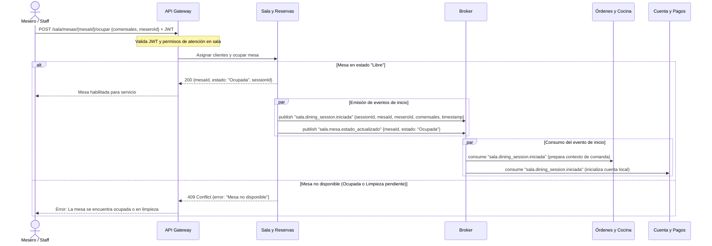
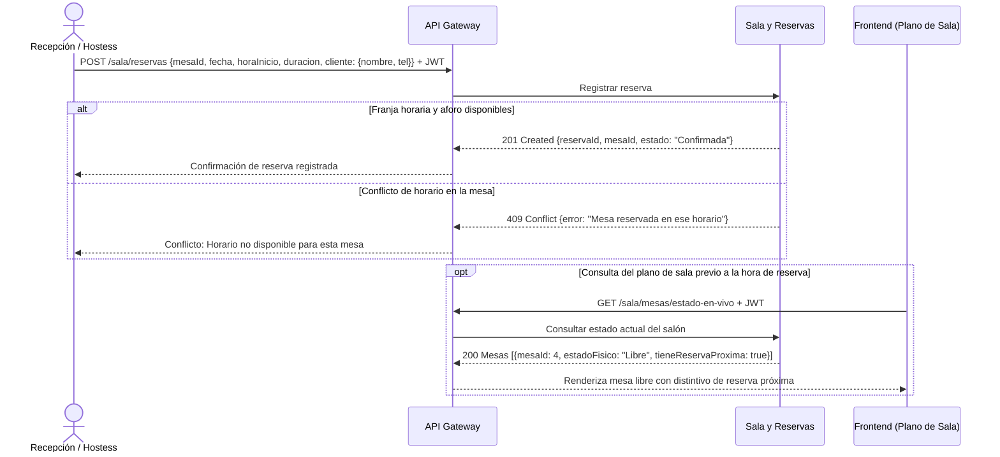
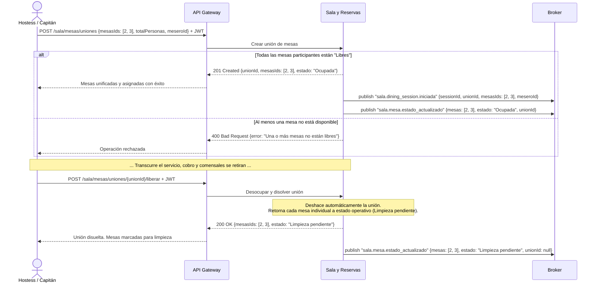
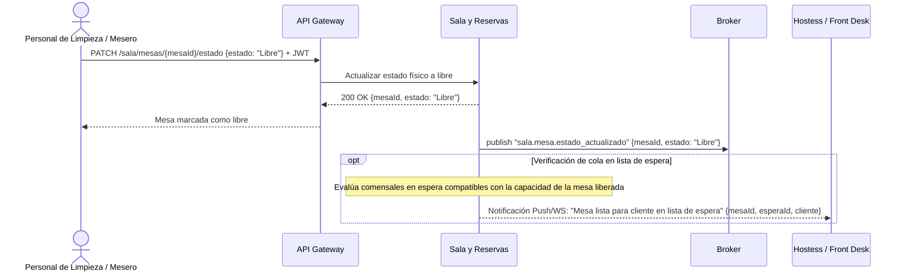
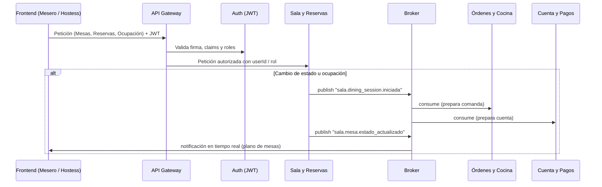

# Documentación Técnica: Microservicio de Sala y Reservas

## 1. Explicación del Microservicio
El microservicio de **Sala y Reservas** gestiona el plano físico del restaurante, el ciclo operativo de las mesas, la asignación del personal de salón y la administración de la demanda entrante (reservas agendadas y lista de espera presencial).

Es el módulo central para la operativa de sala: determina la disponibilidad física de mesas en tiempo real, controla las uniones y liberaciones de mesas para eventos o grupos grandes, y orquesta el inicio formal del servicio mediante el evento asíncrono `sala.dining_session.iniciada` hacia el resto del ecosistema cuando una mesa es ocupada. Mantiene completamente desacoplada la gestión física del restaurante respecto a la comanda gastronómica (Órdenes y Cocina) y la liquidación contable (Cuenta y Pagos).

---

## 2. Entidades del Dominio de Sala (Modelo de Datos Propio)

Sala gestiona exclusivamente las entidades físicas y operativas de su dominio. **No persiste sesiones de consumo (`DiningSession`)**, limitándose a emitir el evento que las detona en los servicios de negocio correspondientes:

* **`Mesa`:** `id_mesa`, `numero_mesa`, `capacidad`, `zona`, `estado_fisico` (*Libre*, *Ocupada*, *Limpieza pendiente*), `id_union_mesa` (FK nullable).
* **`Reserva`:** `id_reserva`, `id_mesa` (FK), `nombre_contacto`, `telefono_contacto`, `fecha_reserva`, `hora_inicio`, `hora_fin`, `estado` (*Confirmada*, *Cancelada*, *Completada*).
* **`AsignacionMesero`:** `id_asignacion`, `id_mesa` (FK), `id_mesero` (referencia externa de Auth), `fecha_hora_inicio`, `fecha_hora_fin`, `activo`.
* **`ListaEspera`:** `id_espera`, `nombre_cliente`, `telefono_contacto`, `cantidad_personas`, `hora_llegada`, `estado` (*En espera*, *Notificado*, *Sentado*, *Cancelado*), `id_mesa_asignada` (FK nullable).
* **`UnionMesa`:** `id_union`, `fecha_creacion`, `fecha_disolucion`, `estado` (*Activa*, *Disuelta*).

---

## 3. Descripción de Funcionalidades
Alineadas al alcance del dominio de Sala y Reservas:

* **Administración del plano de mesas (CRUD):** Registro, edición y baja lógica de mesas físicas, definiendo identificador único, zona y aforo/capacidad.
* **Gestión del estado físico en tiempo real:** Control del ciclo operativo (`Libre`, `Ocupada`, `Limpieza pendiente`). Provee visibilidad del indicador de `Reserva próxima` sobre mesas libres sin bloquear prematuramente su disponibilidad física antes de la hora acordada.
* **Disparo de inicio de servicio (Dining Session):** Publicación del evento de apertura con los datos de ocupación para que Cocina y Pagos preparen sus respectivos contextos.
* **Asignación y reasignación de meseros:** Vinculación formal del personal responsable a cada mesa activa, soportando cambios de turno y balanceo de carga.
* **Gestión de reservas:** Creación, reprogramación y cancelación de reservaciones asociadas a fecha, hora, mesa y datos de contacto de comensales.
* **Consulta de disponibilidad para reservas:** Filtro de agenda y detección de solapamientos por fecha y franja horaria.
* **Unión y disolución de mesas para grupos:** Fusión lógica de dos o más mesas contiguas para consolidar aforo y disolución automática atómica al liberarse.
* **Gestión y notificación de lista de espera:** Registro de comensales en espera presencial y notificación automática al personal cuando una mesa con aforo compatible queda disponible.

---

## 4. Eventos Asíncronos (Message Broker)

### Eventos que Publica (Publisher)
* **`sala.dining_session.iniciada` (`DinningSessionCreated`):** Emitido en el instante en que comensales son asignados a una mesa y esta pasa a estado `Ocupada`. Permite a *Órdenes y Cocina* habilitar la toma de comandas y a *Cuenta y Pagos* inicializar la cuenta local transaccional.
* **`sala.mesa.estado_actualizado`:** Notifica transiciones de estado operativo (`Libre`, `Ocupada`, `Limpieza pendiente`) hacia frontends de sala, monitores del restaurante y gateways.
* **`sala.reserva.proxima_alerta`:** Notifica al personal de recepción que una mesa cuenta con una reserva entrante dentro de la ventana de anticipación configurada.

### Eventos que Recibe (Subscriber)
* **Microservicio autónomo de eventos entrantes:** Sala no requiere consumir eventos de otros microservicios para operar su ciclo físico.
* **Desacoplamiento con Pagos y Cocina:** Sala **no** transiciona automáticamente las mesas a `Libre` tras recibir `PagoCompletado` ni tras el cierre de comandas. La transición a `Limpieza pendiente` y posterior `Libre` se realiza únicamente mediante confirmación operativa del personal de sala.

---

## 5. Diagramas de Secuencia (Interacción entre Microservicios)

> **Criterio de abstracción:** Se representa la interacción entre fronteras de servicios, API Gateway y Message Broker sin exponer bases de datos internas, repositorios ni componentes de persistencia.

---

### Flujo 1: Ocupación de mesa y disparo de Dining Session
Cuando un mesero o capitán asigna comensales a una mesa libre, se valida el personal asignado, se actualiza el estado físico a `Ocupada` y se emite el evento para que Cocina y Pagos preparen la sesión.



---

### Flujo 2: Registro y consulta de reserva con alerta visual

Un comensal solicita una reservación. El sistema verifica disponibilidad de horario y capacidad de la mesa. En el plano de sala se proyecta el estado de reserva próxima sin bloquear físicamente la mesa de forma prematura.



---

### Flujo 3: Unión y liberación automática de mesas para grupos grandes

Cuando un grupo grande supera la capacidad individual de una mesa, se unen dos o más mesas físicas bajo un agrupamiento temporal. Al retirarse los comensales, la unión se disuelve de forma atómica y las mesas pasan a limpieza.



---

### Flujo 4: Fin de limpieza física y notificación a Lista de Espera

Cuando el personal concluye la limpieza física de la mesa, actualiza su estado a `Libre`. En ese momento, Sala evalúa si existen clientes en lista de espera compatibles con la capacidad liberada para alertar a recepción.



---

## 6. Vista Resumida de Dependencias de Sala



---

## 7. Catálogo de Interacciones Propuestas

| Origen | Medio | Destino | Interacción / Propósito |
|---|---|---|---|
| Frontend (Staff) | API Gateway | Sala | CRUD de mesas, actualización manual de estado físico y asignación de mesero |
| Frontend (Hostess) | API Gateway | Sala | Gestión de reservas, uniones de mesas y registro en lista de espera |
| Auth | API Gateway (JWT) | Sala | Identidad y roles de meseros y staff validados en cabeceras HTTP |
| Sala | Message Broker | Órdenes y Cocina | `sala.dining_session.iniciada`: Habilita apertura de comandas para la mesa/sesión |
| Sala | Message Broker | Cuenta y Pagos | `sala.dining_session.iniciada`: Prepara la cuenta local transaccional vinculada a la sesión |
| Sala | Message Broker | Frontends / Monitores | `sala.mesa.estado_actualizado`: Reflejo en tiempo real del plano de sala |
| Sala | Message Broker / Push | Hostess / Recepción | `sala.reserva.proxima_alerta`: Alerta de proximidad de horario de reserva |

---

## 8. Límites y Fronteras de Dominio

Para conservar la separación de responsabilidades y la consistencia en la arquitectura:

* **Base de datos de Sala (`Sala DB`) o repositorios internos:** No se exponen transacciones SQL, migraciones ni componentes de persistencia internos en diagramas de arquitectura.
* **No persiste ni gestiona `DiningSession`:** Sala no es dueña del ciclo de vida, estados ni cierre de la sesión de consumo. Únicamente detona el evento inicial al ocupar físicamente la mesa. El ciclo de vida de la sesión pertenece a *Órdenes y Cocina* y a *Cuenta y Pagos*.
* **Cero acoplamiento con Menú:** Sala no almacena platillos, modificadores ni cartas de precios, ni consume eventos del catálogo comercial.
* **No almacena comandas ni platillos:** La selección de alimentos, el snapshot comercial y los tiempos KDS pertenecen exclusivamente a *Órdenes y Cocina*.
* **No gestiona pagos ni facturación:** Las transacciones, formas de cobro y arqueos pertenecen a *Cuenta y Pagos*.
* **No transiciona mesas por `PagoCompletado`:** La liberación física de la mesa depende de la salida real del comensal y de la confirmación del personal de sala.
* **No valida credenciales ni contraseñas:** La autenticación y roles provienen de *Auth* validados por el API Gateway.

---

## 9. Notas para Validar con el Equipo

1. **Generación del `sessionId`:** Confirmar si el identificador de sesión (`sessionId`) es generado por Sala como un UUID correlativo al momento de emitir `sala.dining_session.iniciada`, o si Órdenes y Cocina genera su propio ID interno asociándolo a `mesaId`. (Se recomienda que Sala genere un `sessionId` UUID en el evento para que tanto Órdenes como Pagos compartan el mismo ID de correlación).
2. **Mapeo de meseros externos:** Confirmar si `id_mesero` en `AsignacionMesero` almacena un UUID o string derivado del claim `sub` del JWT emitido por Auth.
3. **Criterio de tiempo para "Reserva Próxima":** Definir la ventana temporal (ej. 30 o 45 minutos antes de la hora acordada) para activar el indicador visual de reserva próxima en el plano de mesas sin bloquear la mesa a clientes espontáneos antes de tiempo.

---

## 10. Arquitectura de Implementación y Stack Tecnológico

### 10.1 Estrategia de Repositorio: Monorepo Modular (Service-Level Monorepo)

Para el desarrollo del microservicio de **Sala y Reservas**, se adopta un esquema de **Monorepo por Módulo / Microservicio** gestionado con **pnpm workspaces** y **Turborepo**.

```text
sala-module/
├── apps/
│   ├── api/                     # Backend (NestJS / TypeScript)
│   │   ├── src/
│   │   │   ├── modules/mesas/   # CRUD, plano y transiciones
│   │   │   ├── modules/reservas/# Agenda, franjas y validaciones
│   │   │   ├── modules/uniones/ # Agrupación atómica de mesas
│   │   │   ├── modules/espera/  # Fila presencial
│   │   │   ├── events/          # Publishers RabbitMQ (dining_session, mesa_actualizada)
│   │   │   └── gateways/        # WebSocket Gateway (tiempo real hacia frontend)
│   │   └── Dockerfile
│   └── web/                     # Frontend (React + Vite + Tailwind CSS)
│       ├── src/
│       │   ├── components/      # Tableros de mesas, modales, alertas
│       │   ├── hooks/           # useMesasSocket, useReservasQuery
│       │   └── views/           # Plano de Sala, Reservas, Espera
│       └── Dockerfile
├── packages/
│   └── shared/                  # Contratos y tipos compartidos
│       ├── src/
│       │   ├── enums/           # EstadoMesa, EstadoReserva, EstadoEspera
│       │   ├── interfaces/      # Mesa, Reserva, EventPayloads
│       │   └── schemas/         # Validaciones Zod / DTOs comunes
│       └── package.json
├── docker-compose.yml           # Postgres, RabbitMQ y servicios locales
├── turbo.json                   # Cacheo inteligente y pipelines de build/test
└── package.json                 # Workspaces raíz
```

#### Ventajas Técnicas para el Dominio de Sala:
1. **Fuente Única de Verdad de Contratos:** Los tipos de datos de las mesas, payloads de eventos (`sala.dining_session.iniciada`, `sala.mesa.estado_actualizado`) y enums de estado se declaran una sola vez en `packages/shared`, eliminando desincronización entre Front y Back.
2. **Pull Requests Atómicos:** Cambios en endpoints, eventos de broker o esquemas de datos se implementan, prueban y revisan en un único PR.
3. **Desarrollo Local Acelerado:** Un solo comando levanta la base de datos, el broker, el API y el frontend con recarga en vivo sincronizada.
4. **Independencia Operativa:** Mantiene los límites del dominio de Sala completamente aislados de los repositorios de Cocina o Pagos, facilitando su CI/CD independiente.

---

### 10.2 Stack Tecnológico Oficial

| Capa | Tecnología | Propósito y Justificación Técnica |
|---|---|---|
| **Lenguaje Común** | **TypeScript 5.x** | Tipado estricto end-to-end entre frontend, backend y contratos de mensajería compartidos. |
| **Backend API** | **Node.js + NestJS** | Arquitectura limpia orientada a módulos, controladores e inyección de dependencias. Cuenta con soporte nativo out-of-the-box para WebSockets y microservicios con brokers de mensajería. |
| **Base de Datos** | **PostgreSQL 16** | Consistencia transaccional estricta (ACID) requerida para la unión de mesas (`UnionMesa`) y soporte de tipos de rango temporal (`tstzrange` con restricciones `EXCLUDE`) para prevenir solapamientos de reservas a nivel motor. |
| **ORM / Migraciones** | **Prisma** o **Drizzle ORM** | Modelado declarativo de esquemas, migraciones reproducibles y generación de tipos fuertemente tipados. |
| **Message Broker** | **RabbitMQ** (o **Redis Streams**) | Publicación asíncrona de eventos de integración (`sala.dining_session.iniciada`, `sala.mesa.estado_actualizado`) garantizando el desacoplamiento con Cocina y Pagos. |
| **Frontend SPA** | **React 18/19 + Vite** | Interfaz reactiva para el personal de salón y recepción. Renderizado optimizado para el plano visual de mesas. |
| **Diseño y Estilos** | **Tailwind CSS + shadcn/ui** | Consistencia visual idéntica a los mockups de diseño aprobados (`mockups_sala.html`), modularidad y accesibilidad. |
| **Comunicación en Vivo** | **WebSockets (Socket.io)** | Transmisión bidireccional inmediata de cambios de estado físico de mesas y alertas de reserva próxima sin polling innecesario. |
| **Estado y Caché Front** | **TanStack Query (React Query)** | Sincronización transparente de peticiones HTTP con invalidación automática detonada por eventos de WebSocket. |
| **Gestión Monorepo** | **pnpm Workspaces + Turborepo** | Enlaces simbólicos eficientes para dependencias, compilación en paralelo y caché de tareas de prueba y build. |

